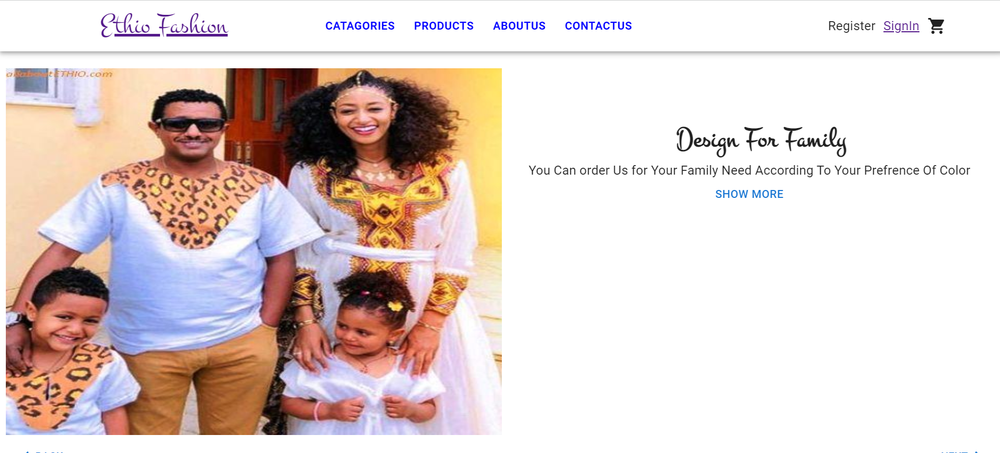
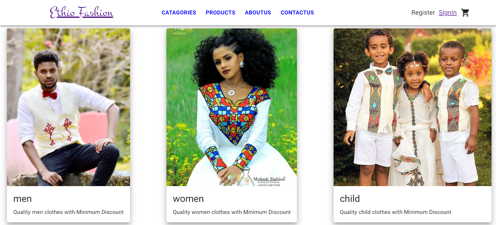
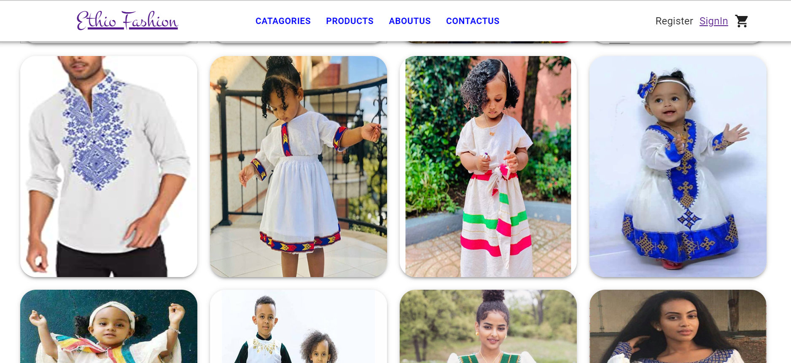
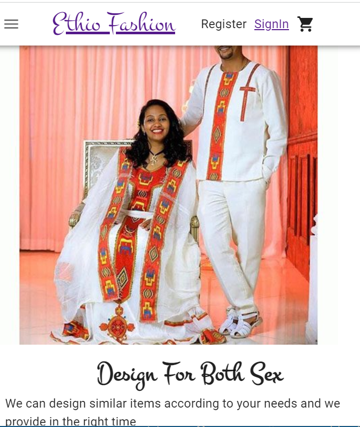

# react-ecommerce

this project is aimed to design habeshan traditional cloth selling online shop 
it is fully builed using mern stack ( react - nodejs , mongodb , express )
for styling and design I used material ui library 
some of the design images area given below 

